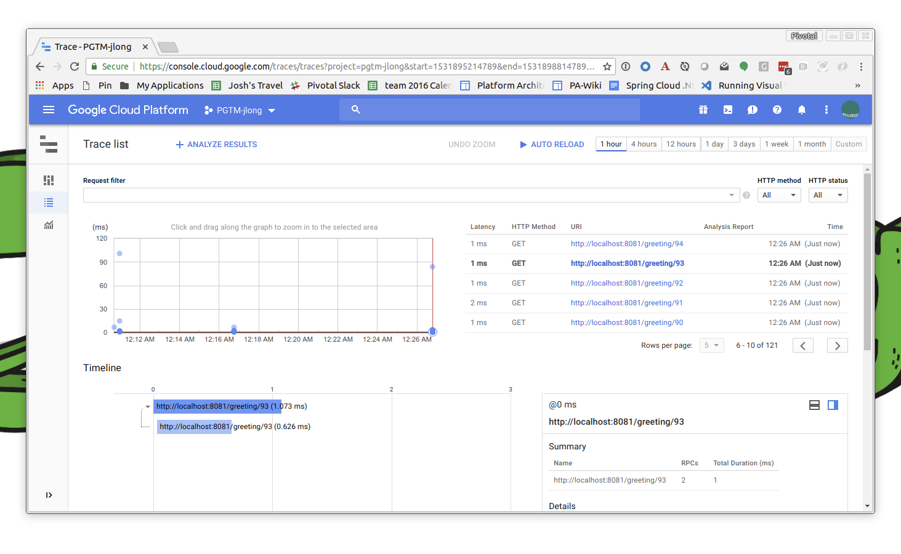

= Spring Cloud GCP

Hi Spring fans! In this installment of Spring Tips we will look at https://cloud.spring.io/spring-cloud-gcp[the Spring Cloud GCP project]. The Spring Cloud GCP project endeavors to provide a first class experience for Spring Cloud developers when using the Google Cloud Platform.

== Getting Started with GCP

You'll need to sign up for https://console.cloud.google.com/[a GCP account]. In order to use the Spring Cloud GCP project on your local machine, you'll want to https://cloud.google.com/pubsub/docs/quickstart-cli[setup a project on GCP and have the `gcloud` CLI installed] locally.


There are a few things to know and do before starting any work with GCP. First, you'll need to login. Run the following command to login to GCP:


[source,shell]
----
gcloud auth application-default login
----

This will make it easy to provide default credentials supporting work your interactions with the platform. In this case, you're saying that you want to allow certain operations on _your_ behalf.

Some operations endure independent of a particular user. They might need granular permissions that represent a subset of your privilege. They might be run independent of a given user, as in a batch job or something that runs nightly. In this case, it makes sense to use a _service account_. We'll need to configure a _service account_ later when we look at tracing.

It's useful to know your _Project ID_. You'll find a lot of incantations need to know this value.  I have a little script like this that is run in my `~/.bashrc` and is contributed to every shell.


.gcp.sh
[source,shell]
----
export PROJECT_ID=$(gcloud config list --format 'value(core.project)')
----

I tend to stick to the CLI in these examples, but most everything you want to do can be done from the web console, too.

== Getting Started with Spring Cloud GCP

You'll need, at least for now, the Spring Cloud _and_ Spring Cloud GCP bill of materials (BOM) artifacts. We're going to use Spring Boot 2.0.3, Spring Cloud Finchley RELEASE and Spring Cloud GCP 1.1.0.BUILD-SNAPSHOT. Here's a skeletal project `pom.xml`.

.pom.xml
[source,xml]
----

<?xml version="1.0" encoding="UTF-8"?>
<project xmlns="http://maven.apache.org/POM/4.0.0" xmlns:xsi="http://www.w3.org/2001/XMLSchema-instance"
         xsi:schemaLocation="http://maven.apache.org/POM/4.0.0 http://maven.apache.org/xsd/maven-4.0.0.xsd">
    <modelVersion>4.0.0</modelVersion>

    <groupId>com.example</groupId>
    <artifactId>gcp</artifactId>
    <version>0.0.1-SNAPSHOT</version>
    <packaging>jar</packaging>

    <parent>
        <groupId>org.springframework.boot</groupId>
        <artifactId>spring-boot-starter-parent</artifactId>
        <version>2.0.3.RELEASE</version>
        <relativePath/>
    </parent>

    <properties>
        <project.build.sourceEncoding>UTF-8</project.build.sourceEncoding>
        <project.reporting.outputEncoding>UTF-8</project.reporting.outputEncoding>
        <java.version>1.8</java.version>
        <spring-cloud-gcp.version>1.1.0.BUILD-SNAPSHOT</spring-cloud-gcp.version>
        <spring-cloud.version>Finchley.RELEASE</spring-cloud.version>
    </properties>

    <dependencies>
        <dependency>
            <groupId>org.springframework.cloud</groupId>
            <artifactId>spring-cloud-gcp-starter</artifactId>
        </dependency>
        <dependency>
            <groupId>com.google.guava</groupId>
            <artifactId>guava</artifactId>
            <version>20.0</version>
        </dependency>
        <dependency>
            <groupId>org.projectlombok</groupId>
            <artifactId>lombok</artifactId>
        </dependency>
        <dependency>
            <groupId>org.springframework.boot</groupId>
            <artifactId>spring-boot-starter-test</artifactId>
            <scope>test</scope>
        </dependency>
    </dependencies>

    <dependencyManagement>
        <dependencies>
            <dependency>
                <groupId>org.springframework.cloud</groupId>
                <artifactId>spring-cloud-dependencies</artifactId>
                <version>${spring-cloud.version}</version>
                <type>pom</type>
                <scope>import</scope>
            </dependency>
            <dependency>
                <groupId>org.springframework.cloud</groupId>
                <artifactId>spring-cloud-gcp-dependencies</artifactId>
                <version>${spring-cloud-gcp.version}</version>
                <type>pom</type>
                <scope>import</scope>
            </dependency>
        </dependencies>
    </dependencyManagement>

    <build>
        <plugins>
            <plugin>
                <groupId>org.springframework.boot</groupId>
                <artifactId>spring-boot-maven-plugin</artifactId>
            </plugin>
        </plugins>
    </build>

    <repositories>
        <repository>
            <id>spring-snapshot</id>
            <name>Spring Snapshot</name>
            <url>https://repo.spring.io/snapshot</url>
            <snapshots>
                <enabled>true</enabled>
            </snapshots>
        </repository>
    </repositories>
</project>

----


==  SQL Data and MySQL

GCP offers  managed SQL services including MySQL and PostgreSQL. Let's provision a MySQL instance and use that from a Spring Boot-based application. You'll need to first enable the SQL APIs in Google Cloud:

```
gcloud services enable sqladmin.googleapis.com
```

Then, you'll need to provision a new Google Cloud SQL instance in a particular region. The default is MySQL. (This could take several minutes!)

```
gcloud sql instances create reservations --region=us-central1
```

Then, provision a new database in that Google Cloud SQL instance:

```
gcloud sql databases create reservations --instance reservations
```

Spring won't know how to connect to the SQL database instance hosted on GCP. Add the GCP MySQL starter: `org.springframework.cloud` : `spring-cloud-gcp-starter-sql-mysql`. This starter, and a dash of configuration, can connect your application to the platform.

What configuration, you say? Well, Spring applications have bean definitions (in Java code) and property definitions (in any number of different property sources, including `.yaml` and  `.properties` files and, as we'll see later, GCP's RuntimeConfig mechanism). You can selectively activate particular bean definitions and property definitions with _profiles_. Spring profiles are arbitrary labels that identify distinct bean and property configurations that could be selectively _activated_. In this example, we're using the `mysql` profile.

Let's look at the configuration for the `mysql` profile, in `src/main/resources/application-mysql.properties`:

.application-mysql.properties
[source,properties]
----
# <1>
spring.cloud.gcp.sql.database-name=reservations
spring.cloud.gcp.sql.instance-connection-name=pgtm-jlong:us-central1:reservations
# <2>
spring.datasource.initialization-mode=always
spring.datasource.hikari.maximum-pool-size=2
----
<1> these properties identify to which GCP SQL instance and database the client should connect
<2> tells Spring to initialize the schema by running `src/main/resources/schema.sql`, if present
<3> there are standard Spring Boot properties that configure the Hikari connection pool. HikariCP is the default connection pool in Spring Boot 2 or later.

Here is the DDL for the MySQL table. In it, we delete the table and then re-create it.

[source,sql]
----
DROP TABLE IF EXISTS reservations;

CREATE TABLE reservations (
  id   BIGINT    NOT NULL AUTO_INCREMENT,
  name CHAR(128) NOT NULL,
  PRIMARY KEY (id)
);
----

In this example, we're letting Spring Boot configure the database.  There are alternative approaches. We could use  `gcloud sql connect $GCP_SQL_INSTANCE` where `$GCP_SQL_INSTANCE` should be replaced with your GCP SQL instance name. In this case, the SQL instance name is `reservations`. This will dump you into a MySQL session connected to the remote database in which you can interactively issue the relevant schema DDL.


This is a demo, so let's install some sample data as well. You can create a file, `src/main/resources/data.sql`, and Spring will execute that on applicaton startup, or you can use `gcloud sql connect`. Either way, run the following statements.


[source,sql]
----
insert into reservations(name) values('ray');
insert into reservations(name) values('josh');
----

Now you can talk to the database from your Spring application like you would any other SQL database.

[source,java]
----
package com.example.gcp.mysql;

import lombok.AllArgsConstructor;
import lombok.Data;
import lombok.NoArgsConstructor;
import org.apache.commons.logging.Log;
import org.apache.commons.logging.LogFactory;
import org.springframework.boot.SpringApplication;
import org.springframework.boot.autoconfigure.SpringBootApplication;
import org.springframework.boot.context.event.ApplicationReadyEvent;
import org.springframework.context.annotation.Profile;
import org.springframework.context.event.EventListener;
import org.springframework.jdbc.core.JdbcTemplate;
import org.springframework.jdbc.core.RowMapper;

import java.util.Collection;

@Profile("mysql")
@SpringBootApplication
public class MySqlApplication {

		private final Log log = LogFactory.getLog(getClass());
		private final JdbcTemplate template;
		private final RowMapper<Reservation> rowMapper =
			(rs, rowNum) -> new Reservation(rs.getLong("id"), rs.getString("name"));

		MySqlApplication(JdbcTemplate template) {
				this.template = template;
		}

		@EventListener(ApplicationReadyEvent.class)
		public void ready() {
				Collection<Reservation> reservations = this.template.query("select * from reservations", this.rowMapper);
				reservations.forEach(reservation -> log.info("reservation: " + reservation.toString()));
		}

		public static void main(String args[]) {
				SpringApplication.run(MySqlApplication.class, args);
		}
}

@Data
@AllArgsConstructor
@NoArgsConstructor
class Reservation {
		private Long id;
		private String reservationName;
}

----

Run the application and confirm that the results are reflected in the output.

At this point you should be on familiar footing; you can use Spring Data JPA and Spring Data REST, JOOQ, MyBatis, or any of the various JDBC-based technologies, along with Spring Boot, to work with this GCP-managed MySQL instance.

== NoSQL or NewSQL Data and Google Spanner

MySQL and PostgreSQL are familiar friends in an unfamiliar land, but they're not why we're here. No no. Were I you, I'd look at a platform like GCP and take from it the best bits; the parts that have no analog elsewhere. The things that separate it from the other platforms. One such distinguishing feature is https://en.wikipedia.org/wiki/Spanner_(database)[Google Spanner]. Spanner is.. something else entirely.

Google first revealed Spanner when they introduced F1, a SQL database engine that the Adwords team moved to, _away_ from MySQL ("But Josh!," I hear you exclaim, "Didn't we just deploy to MySQL??"), in 2012. Spanner provides low latency reads, and to a lesser extent writes, globally. Google announced it http://static.googleusercontent.com/media/research.google.com/en//archive/spanner-osdi2012.pdf[in 2012 in a research paper] in which it called Spanner "the first system to distribute data at global scale and support externally-consistent distributed transactions."

"Spanner is impressive work on one of the hardest distributed systems problems - a globally replicated database that supports externally consistent transactions within reasonable latency bounds," https://www.zdnet.com/article/google-reveals-spanner-the-database-tech-that-can-span-the-planet/[said Andy Gross], principal architect at Basho.

Spanner is able to offer such a broad amount of geographic redundancy thanks to a method Google has developed of being able to give precise times to applications to let them write, read and replicate data without making mistakes. Spanner's "TrueTime" API depends upon GPS receivers and atomic clocks that have been installed in Google's datacentres to let applications get accurate time readings locally without having to sync globally.

Spanner is a successor to technologies like Bigtable. BigTable only supported eventually consistent replication across datacenters. According to the paper: "At least 300 applications within Google use Megastore (despite its relatively low performance) because its data model is simpler to manage than Bigtable's and because of its support for synchronous replication across datacenters." At the time, applications like GMail, Picasa, Calendar, Android Market and AppEngine relied on MegaStore.

Transactions are a first-class concept in Spanner driven, in part, by their absence in BigTable.

"The lack of cross-row transactions in Bigtable led to frequent complaints; Percolator
was in part built to address this failing. Some authors have claimed that general two-phase commit is too expensive to support, because of the performance or availability
problems that it brings. We believe it is better to have application programmers deal with performance problems due to overuse of transactions as bottlenecks arise, rather than always coding around the lack of transactions. Running two-phase commit over Paxos mitigates the availability problems."

Well alright! I'm simultaneously interested and intimidated! I _want_ Spanner, but I _don't_ want to have to rack and stack servers and synchronize GPS recivers and atomic clocks. But, _something_ tells me Google'd be happy to do that for me, so let's try it out.

As before, you'll need to enable the API for Google Cloud GCP Spanner before you can use it:

[source,shell]
----
gcloud services enable spanner.googleapis.com
----

Then, create a new Google Cloud Spanner instance:

[source,shell]
----
gcloud spanner instances create reservations --config=regional-us-central1 \
  --nodes=1 --description="Reservations for everybody"
----

Then, create the database instance:

[source,shell]
----
gcloud spanner databases create reservations --instance=reservations
----

Confirm the Spanner instance is available:

[source,shell]
----
gcloud spanner databases list --instance=reservations
----

Once the instance is `READY`, it's time to create the table. Here's the Spanner DDL. If this looks uncannily like SQL, that's good! It should. Put this DDL into a separate file. I've called it `schema.ddl`.

.schema.ddl
[source,sql]
----
CREATE TABLE reservations (
  id        STRING (36) NOT NULL,
  name      STRING (255) NOT NULL
) PRIMARY KEY (id);
----


Register the schema with the database.

[source,shell]
----
gcloud spanner databases ddl update reservations \
  --instance=reservations --ddl="$(<./gcp/src/main/resources/db/schema.ddl )"
----

Now we can read the data from Spanner in our Spring application. The auto-configuration needs a little bit of configuration in order to talk to the right database.

[source,properties]
----
spring.cloud.gcp.spanner.instance-id=reservations
spring.cloud.gcp.spanner.database=reservations
----

We'll use the brand new Spring Data Spanner module that supports common Spring Data idioms when working with Spanner. Add `org.springframework.cloud` : `spring-cloud-gcp-starter-data-spanner` to your Maven build. Let's use a Spring Data repository to make short work of reading with our database.

[source,java]
----
package com.example.gcp.spanner;

import lombok.AllArgsConstructor;
import lombok.Data;
import lombok.NoArgsConstructor;
import lombok.extern.slf4j.Slf4j;
import org.springframework.boot.SpringApplication;
import org.springframework.boot.autoconfigure.SpringBootApplication;
import org.springframework.boot.context.event.ApplicationReadyEvent;
import org.springframework.cloud.gcp.data.spanner.core.mapping.PrimaryKey;
import org.springframework.cloud.gcp.data.spanner.core.mapping.Table;
import org.springframework.context.event.EventListener;
import org.springframework.data.annotation.Id;
import org.springframework.data.repository.PagingAndSortingRepository;
import org.springframework.data.rest.core.annotation.RepositoryRestResource;

import java.util.UUID;
import java.util.stream.Stream;

@Slf4j
@SpringBootApplication
public class SpannerApplication {

		private final ReservationRepository reservationRepository;

		SpannerApplication(ReservationRepository reservationRepository) {
				this.reservationRepository = reservationRepository;
		}

		@EventListener(ApplicationReadyEvent.class)
		public void setup() {

				// <1>
				this.reservationRepository.deleteAll();

				Stream
					.of("ray", "josh")
					.map(name -> new Reservation(UUID.randomUUID().toString(), name))
					.forEach(this.reservationRepository::save);
				this.reservationRepository.findAll().forEach(r -> log.info(r.toString()));
		}

		public static void main(String args[]) {
				SpringApplication.run(SpannerApplication.class, args);
		}
}

// <2>
@Data
@AllArgsConstructor
@NoArgsConstructor
@Table(name = "reservations")
class Reservation {

		@Id
		@PrimaryKey
		private String id;
		private String name;
}

// <3>
@RepositoryRestResource
interface ReservationRepository extends PagingAndSortingRepository<Reservation, String> {
}
----
<1> We kick off the application, delete existing data and then  write some new data to the database using our Spring Data Spanner-powered repository.
<2> We define the Spring Data Spanner entity using custom mapping annotations, `@Table` and `@PrimaryKey`.
<3> We create a Spring Data repository that is also exposed using Spring Data REST as a REST API.

This example should look familiar if you've ever used Spring Data. Spring Data Spanner builds upon familiar concepts and patterns - templates, repositories, and entities - to support familiar data access patterns with a very different kind of database.

== Application Integration with Google Cloud Pub/Sub

Let's look at application integration with Google Cloud Pub/Sub. Google Cloud Pub/Sub supports a number of classic enterprise application integration use cases at Google scale. The https://cloud.google.com/pubsub/docs/overview[Google Cloud website for Pub/Sub] lists some:

* **Balancing workloads in network clusters**. For example, a large queue of tasks can be efficiently distributed among multiple workers, such as Google Compute Engine instances.
* **Implementing asynchronous workflows**. For example, an order processing application can place an order on a topic, from which it can be processed by one or more workers.
* **Distributing event notifications**. For example, a service that accepts user signups can send notifications whenever a new user registers, and downstream services can subscribe to receive notifications of the event.
* **Refreshing distributed caches**. For example, an application can publish invalidation events to update the IDs of objects that have changed.
* **Logging to multiple systems**. For example, a Google Compute Engine instance can write logs to the monitoring system, to a database for later querying, and so on.
* **Data streaming from various processes or devices**. For example, a residential sensor can stream data to backend servers hosted in the cloud.
* **Reliability improvement**. For example, a single-zone Compute Engine service can operate in additional zones by subscribing to a common topic, to recover from failures in a zone or region.

The flow when using Google Cloud Pub/Sub is exactly as you'd expect: a message is sent to a topic in the Pub/Sub broker (hosted  in the cloud by GCP) which then persists it for you. Subscribers can either have messages pushed to it (through a webhook) or they can poll for the mesages from the broker. The subscriber receives messages from the broker and acknowledges each one. When a subscriber acknowledges a messaage it is removed from the subscriber's subscription queue. Any client that can speak HTTPS can use this service. There's no other API required.

The domain model is fairly straightforward if you've ever used any other messaging system (JMS, AMQP, Apache Kafka, Kestrel): a topic is the thing to which messages are published. A subscription represents the stream o messages from a specific topic that are to be delivered to a specific client application.  A topic can have multiple subscriptions.  A subscription can have many subscribers.  If you want to distribute different messages around to different subscribers, then all the subscribers must be subscribing to the same subscription.  If you want to publish the same messages to all the subscribers, then each subscriber needs to subscribe to its own subscription.

Pub/Sub delivery is at-least once. Hence, you must deal with idempotency and/or de-duplicate messages if you cannot process the same message more than once.

A message stores a combination of data and (optional) attributes that are conducted by Google Cloud Pub/Sub from a publisher to a subscriber. A message attribute, which you might better understand as a _header_, is a key value pair in a message. You might have a header the describes the language of the payload. You might have a header that describes the content-type.

Let's add Google Cloud Pub/Sub to an application and tie them together.

As before, we need to enable the Google Cloud Pub/Sub API for use.

[source,shell]
----
gcloud services enable pubsub.googleapis.com
----

You'll then need to create a new topic, `reservations`.

[source,shell]
----
gcloud pubsub topics create reservations
----

The topic represents where we will send messages. We still need to create a subscription that consumes messages from that topic. The following command creates a subscription, `reservations-subscription`, to connect to the `reservations` topic.

[source,shell]
----
gcloud pubsub subscriptions create reservations-subscription --topic=reservations
----

Those pieces in place, we can use them from our application. Add the Spring Cloud GCP Pub/Sub starter, `org.springframework.cloud` : `spring-cloud-gcp-starter-pubsub`, to your  build. This introduces auto-configuration  for the Google Cloud `PubSubTemplate`. The `PubSubTemplate` should feel familiar if you've ever used the `JmsTemplate` or `KafkaTemplate`. It's an easy-to-use client for producing and consuming messages with Google Cloud Pub/Sub.  If you're just getting started with GCP Pub/Sub and messaging in general, a `*Template` object in the Spring universe is a good place to start.

Let's look at a simple example that publishes a message whenever you issue HTTP `POST` calls to an HTTP endpoint running in the Spring Boot application. Then we'll setup a subscriber to consume the messages sent.

[source,java]
----
package com.example.gcp.pubsub.template;

import org.springframework.beans.factory.annotation.Value;
import org.springframework.cloud.gcp.pubsub.core.PubSubTemplate;
import org.springframework.context.annotation.Configuration;
import org.springframework.web.bind.annotation.PathVariable;
import org.springframework.web.bind.annotation.PostMapping;
import org.springframework.web.bind.annotation.RestController;

@Configuration
@RestController
class PublisherConfig {

		private final PubSubTemplate template;
		private final String topic;

		PublisherConfig(PubSubTemplate template,
						 @Value("${reservations.topic:reservations}") String t) {
				this.template = template;
				this.topic = t;
		}

		// <1>
		@PostMapping("/publish/{name}")
		void publish(@PathVariable String name) {
				this.template.publish(this.topic, "Hello " + name + "!");
		}
}
----
<1> we use the injected `PubSubTemplate` to send a message - a String - to the configured topic.

Now, let's look at a simple application that might as easily run in another node that consumes messages from the subscription linked to the topic.

[source,java]
----
package com.example.gcp.pubsub.template;

import lombok.extern.slf4j.Slf4j;
import org.springframework.beans.factory.annotation.Value;
import org.springframework.boot.context.event.ApplicationReadyEvent;
import org.springframework.cloud.gcp.pubsub.core.PubSubTemplate;
import org.springframework.context.annotation.Configuration;
import org.springframework.context.event.EventListener;

@Slf4j
@Configuration
class SubscriberConfig {

		private final PubSubTemplate template;
		private final String subscription;

		SubscriberConfig(PubSubTemplate template,
																			@Value("${reservations.subscription:reservations-subscription}") String s) {
				this.template = template;
				this.subscription = s;
		}

		@EventListener(ApplicationReadyEvent.class)
		public void start() {
				//<1>
				this.template.subscribe(this.subscription, (pubsubMessage, ackReplyConsumer) -> {
						log.info("consumed new message: [" + pubsubMessage.getData().toStringUtf8() + "]");
						ackReplyConsumer.ack();
				});
		}
}
----
<1> Once the application is up and running we explicitly subscribe, connecting our client to the right endpoint.

This example uses the `PubSubTemplate` (to great effect). It's simple, short and sweet. As integration becomes more complex, however, it becomes useful to decouple components involved in the flow of messages from one system to another. We introduce stages - links in a chain of components - through which messages must pass to arrive at downstream components. This staging allows us to write handling code that can be swapped out, indifferent to the origin or destination of a given messsage. This promotes testing, because components need onlt be written in terms of their immedaite pre- and post-conditions: a componet can say it onlt accepts Spring Framework `Message<File>` types, and nothing else. This interface indirection is _very_ handy, especiallt as we start to tie together real world systems that may handle work at different cadences. It becomes trivial to introduce a broker to buffer work before it reaches downstream components where it may otherwise bottleneck. This approach - of isolating components involved in a messaging flow and introducing a buffer to protect downstream components - is called a _staged event driven architecture_ (SEDA), and it is more valuable now as the world moves to microservices and highly distributed systems than ever.

Spring Integration is a framework that's designed to promote this indirection. It has at its heart the concept of a `MessageChannel`, which you can think of us an in-memory `Queue`; a pipe through which messages flow. On each side of the `MessageChannel` are sat components. You can imagine one component outputting messages of a certain type and sending them into this `MessageChannel`, oblivious to where it'll go. On the other end is another component that consumes messages of a certain type, utterly oblivious to the origin of any given message. Today there may be one service involved in the production of the message. Tomorrow there may be ten! The upstream and downstream components need not change. This indirection gives us a lot of possibilities. We change routing for a given message, stringing it through different services, splitting it, aggregating it, etc. We can transform other sources of data and adapt them to the messaging flow upstream (that's called an inbound adapter). We can introduce new sinks for the data, adapting the Spring Framework `Message<T>` into the right type (that's called an _outbound adapter_).

Let's look at Spring Integration and the Google Cloud Pub/Sub inbound and outbound adapters. We'll keep the same approach as before: an HTTP endpoint will publish messages which then get delivered to Google Cloud Pub/Sub. The code could run in different nodes. You'll also need the Spring Integration types on the classpath for this example to work. Add `org.springframework.boot` : `spring-boot-starter-integration` to the build.

Let's look at a publisher that publishes messages whenever an HTTP POST is made. In this case, the publisher sends requests into a `MessageChannel` which then delivers it to a `PubSubMessageHandler`. Today it's going directly to Pub/Sub, but tomorrow it could go to a database, an FTP server, XMPP, Salesforce, or literallt anything else, and _then_ off to Pub/Sub.

[source,java]
----
package com.example.gcp.pubsub.integration;

import lombok.extern.slf4j.Slf4j;
import org.springframework.beans.factory.annotation.Value;
import org.springframework.cloud.gcp.pubsub.core.PubSubTemplate;
import org.springframework.cloud.gcp.pubsub.integration.outbound.PubSubMessageHandler;
import org.springframework.context.annotation.Bean;
import org.springframework.context.annotation.Configuration;
import org.springframework.integration.dsl.IntegrationFlow;
import org.springframework.integration.dsl.IntegrationFlows;
import org.springframework.integration.dsl.channel.MessageChannels;
import org.springframework.messaging.SubscribableChannel;
import org.springframework.messaging.support.MessageBuilder;
import org.springframework.web.bind.annotation.PathVariable;
import org.springframework.web.bind.annotation.PostMapping;
import org.springframework.web.bind.annotation.RestController;

@Slf4j
@RestController
@Configuration
class PublisherConfig {

		private final String topic;
		private final PubSubTemplate template;

		public PublisherConfig(
			@Value("${reservations.topic:reservations}") String t,
			PubSubTemplate template) {
				this.topic = t;
				this.template = template;
		}

		@Bean
		IntegrationFlow publisherFlow() {
				return IntegrationFlows
					.from(this.outgoing()) // <1>
					.handle(this.pubSubMessageHandler())
					.get();
		}

		@PostMapping("/publish/{name}")
		void publish(@PathVariable String name) {
				// <2>
				outgoing().send(MessageBuilder.withPayload(name).build());
		}

		@Bean
		SubscribableChannel outgoing() {
				return MessageChannels.direct().get();
		}

		@Bean
		PubSubMessageHandler pubSubMessageHandler() {
				return new PubSubMessageHandler(template, this.topic);
		}
}
----
<1> the `IntegrationFlow` describes, well, the _flow_ of messages in an integration. Messages sent into the `outgoing` `MessageChannel` are delivered to the `PubSubMessageHandler` which then writes it to Google Cloud Pub/Sub using the specified `topic`
<2> In the Spring MVC HTTP endpint we obtain a reference to the `MessageChannel` and publish a message (which we build with the `MessageBuilder`) into it. NB: calling `outgoing()` as I do in this example is fine because Spring memoizes the result of the method invocation; I'll always obtain the same pre-instantiated singleto of the `MessageChannel` bean.


On the consumer side, we do the same thing in reverse, adapting incoming messages and then logging them in an `IntegrationFlow`.

[source,java]
----
package com.example.gcp.pubsub.integration;

import com.google.cloud.pubsub.v1.AckReplyConsumer;
import lombok.extern.slf4j.Slf4j;
import org.springframework.beans.factory.annotation.Value;
import org.springframework.cloud.gcp.pubsub.core.PubSubTemplate;
import org.springframework.cloud.gcp.pubsub.integration.AckMode;
import org.springframework.cloud.gcp.pubsub.integration.inbound.PubSubInboundChannelAdapter;
import org.springframework.cloud.gcp.pubsub.support.GcpPubSubHeaders;
import org.springframework.context.annotation.Bean;
import org.springframework.context.annotation.Configuration;
import org.springframework.integration.dsl.IntegrationFlow;
import org.springframework.integration.dsl.IntegrationFlows;
import org.springframework.integration.dsl.channel.MessageChannels;
import org.springframework.messaging.MessageChannel;

@Slf4j
@Configuration
class SubscriberConfig {

		private final String subscription;
		private final PubSubTemplate template;

		SubscriberConfig(
			@Value("${reservations.subscription:reservations-subscription}") String s,
			PubSubTemplate t) {
				this.subscription = s;
				this.template = t;
		}

		@Bean // <1>
		public PubSubInboundChannelAdapter messageChannelAdapter() {
				PubSubInboundChannelAdapter adapter = new PubSubInboundChannelAdapter(
					template, this.subscription);
				adapter.setOutputChannel(this.incoming());
				adapter.setAckMode(AckMode.MANUAL);
				return adapter;
		}

		@Bean
		MessageChannel incoming() {
				return MessageChannels.publishSubscribe().get();
		}

		@Bean
		IntegrationFlow subscriberFlow() {
				return IntegrationFlows
					.from(this.incoming()) //<2>
					.handle(message -> { // <3>
							log.info("consumed new message: [" + message.getPayload() + "]");
							AckReplyConsumer consumer = message.getHeaders()
								.get(GcpPubSubHeaders.ACKNOWLEDGEMENT, AckReplyConsumer.class);
							consumer.ack();
					})
					.get();
		}
}
----
<1> the `PubSubInboundChannelAdapter` adapts messages from the subscription and sends them into the `incoming` `MessageChannel`.
<2> the `IntegrationFlow` takes incoming messages and routes them to a `MessageHandler` (which we've contributed   with lambda syntax) that a) logs the incoming message and b) manually acknowledges the receipt of the message.

The nice thing about `IntegrationFlow` in both examples is that you can chain calls together. Here, we specify only where a message comes from (`.from()`) and what handles it (`.handle()`), but we could as easily after the `.handle()` call also route, split, transform, etc., the messages. The message sent as the output of one component (the adapters, the message handlers, transformers, etc.) become the input to any downstream components.


== Google Cloud Runtime Config

So far we've looked at some simple examples with all but the most trivial of configuration. Where there was configuration, we specified it in `application.properties`.  This approach works but there are limitations. What about centrality (making a single config value accessible to a number of other clients), security (storing secrets securely), live reconfiguration, and auditing and journaling? There are a number of other solutions out there that address some or all of these use cases including Apache Zookeeper, Hashicorp Consul, Hashicorp Vault (for secrets management, specifically), and - of course - the Spring Cloud Config Server. All fine choices, but you'd better have a recipe for scaling out and securing these pieces of infrastructure. GCP offers an alternative, Google Cloud RuntimeConfig, that you can use with no change to existing code, thanks to the power of Spring's abstractions.

Let's look at how to establish a configuration value and then  reference that value  from our application.  We'll also look at how to later update that configuration live, without restarting the application.

First, we'll need to enable this API.

[source,shell]
----
gcloud services enable runtimeconfig.googleapis.com
----

Let's think through how we want to use this configuration. We'll probably have configuration values that make sense when running the application on our local machines. Values that we can source from a built-in `application.properties` or `application.yaml`.  These are the default values that apply to the application. There are going to be some values that are visible only in production -locators, credentials, etc. - that are unique to production. These values might be visible when running under the `cloud` profile, for example. We're going to source those values - when running under the `cloud` profile - from Google Cloud Runtime Config. This way we can selectively override important values.

We must first create a runtime configuration, and then add a variable value tot hat configuration.

[source,shell]
----
gcloud beta runtime-config configs create reservations_cloud
----

Then, register a variable (`greeting`) and that variable's value (`Hello GCP`) in the just-created runtime config.

[source,shell]
----
gcloud beta runtime-config configs variables set greeting  "Hello GCP"  --config-name reservations_cloud
----

We can enumerate all the configuration for a given config set like this:

[source,shell]
----
gcloud beta runtime-config configs variables list --config-name=reservations_cloud
----

Spring Cloud GCP will need to do its work _before_ most of the Spring application is running since it is a property source that feeds values into other configuration. Thus, any configuration that it requires to do its work must be accessible earlier than the configuration in the usual suspects like `application.properties`. It is a convention in Spring Cloud that such configuration live in `bootstrap.properties`. Let's disable Spring Cloud GCP Runtime Config when running on the local machine, without any particular Spring profile active.

.src/main/resources/bootstrap.properties
[source,properties]
----
spring.cloud.gcp.config.enabled=false
----

When we're running in production, in, say, Cloud Foundry, we'll want to activate the `cloud` profile, at which point the Spring Cloud GCP Runtime Config client will kick in and source config from GCP. Spring Boot is smart about loading any profile-specific configuration in adition to default configuration. You need only suffix your configuration file with `-${YOUR_PROFILE}`: e.g.: `application-foo.properties`, or `bootstrap-bar.yml` for Spring profiles `foo` and `bar` respectively. Let's configure Spring Cloud GCP for when the `cloud` profile is active.

.src/main/resources/bootstrap-cloud.properties
[source,java]
----
spring.cloud.gcp.config.enabled=true
spring.cloud.gcp.config.name=reservations
spring.cloud.gcp.config.profile=cloud
----

NOTE: The combination of `${spring.cloud.gcp.config.name}_${spring.cloud.gcp.config.profile}`  forms `reservations_cloud`, which is the name of the Runtime Configuration we've just created.

We will configure some overall properties that will serve as the defaults, absent any overrides, in `src/main/resources/application.properties`.

.src/main/resources/application.properties
[source,properties]
----
# <1>
management.endpoint.health.show-details=always
management.endpoints.web.exposure.include=*
# <2>
greeting = Hello ${user.name} (running on ${os.name} ${os.version})!
----
<1> we want to, for this DEMO, expose all the Actuator endpoints to be able to interrogate them. In any other context, configure security.
<2> we want to include all the Actuator endpoints

Let's turn now to the Java code.  You'll need to add the following dependencies to your build: `org.springframework.boot` : `spring-boot-starter-web`,  `org.springframework.boot` : `spring-boot-starter-actuator`,  `org.springframework.cloud` : `spring-cloud-gcp-starter-config` and `com.google.guava` : `guava` : `20.0`. Yes, having to include and manage down a version of Guava made me just as sad as it did you! We add the Spring Cloud GCP dependency to get the correct configuration for the Runtime Config support. We add the Guava dependency because there's an intractible dependency somewhere downstream that I have every hope will one day be resolved. We add Spring Boot Actuator so we have access to a few operational endpoints, `/actuator/env` and `/actuator/refresh`.

Let's see some code!

[source,java]
----
package com.example.gcp.runtimeconfig;

import org.springframework.beans.factory.annotation.Value;
import org.springframework.boot.SpringApplication;
import org.springframework.boot.autoconfigure.SpringBootApplication;
import org.springframework.cloud.context.config.annotation.RefreshScope;
import org.springframework.web.bind.annotation.GetMapping;
import org.springframework.web.bind.annotation.RestController;

@SpringBootApplication
public class RuntimeConfigApplication {

		@RefreshScope // <1>
		@RestController
		public static class GreetingsRestController {

				private final String greetings;

				// <2>
				GreetingsRestController(@Value("${greeting}") String greetings) {
						this.greetings = greetings;
				}

				@GetMapping("/greeting")
				String greetings() {
						return this.greetings;
				}
		}

		public static void main(String[] args) {
				SpringApplication.run(RuntimeConfigApplication.class, args);
		}
}
----
<1> this annotation supports revising and refreshing the configuration for this bean. We can trigger a refresh event and observe updated configuration in the bean
<2> we're injecting the key from the property file or from GCP Runtime Config. Code-wise, it's exactly the same.

Run this program with no profile active and you should see something like `Hello jlong!` when you hit the endpoint at  `http://localhost:8080/greeting`.Hit this environment Actuator endpoint (`http://localhost:8080/actuator/env`) and you will find no mention of our GCP Runtime Config configuration. Now, run the program with the `cloud` profile active and hit the `/greeting` endpoint again and you'll see something like `Hello GCP` reflected in the console output. Hit the `/actuator/env` endpoint and you'll see an entry for `bootstrapProperties:spring-cloud-gcp` containing our Runtime Config values.

TIP: you can change the active profile by specifying `-Dspring.profiles.active=foo,bar` for profiles `foo` and `bar` when running the application.

I like our application so far, but the greeting sounds so stiff! I'd love to change it, but don't want to stop and start each application instance. Here we can take advantage of the `/actuator/refresh` endpoint to _refresh_ our node's configuration after updating the value in the Runtime Config configuration. Let's change the value to something less formal, like `Hi, GCP`.

[source,shell]
----
gcloud beta runtime-config configs variables set greeting  "Hi, GCP"  --config-name reservations_cloud
----

The configuration has been changed in the GCP Runtime Config, but that change isn't visible, at least not by default, to our application. We need to force the Spring Boot to refresh its local configuration, drawing the configuration from the Runtime Config service. Issue an (empty) HTTP POST command to the `/actuator/refresh` endpoint and then hit the `/greeting` endpoint to see the updated value.

[source,shell]
----
# <1>
curl http://localhost:8080/greeting
> Hello GCP

# <2>
gcloud beta runtime-config configs variables set greeting  "Hi GCP"  --config-name reservations_cloud
curl -H"content-type: application/json" -d{} http://localhost:8080/actuator/refresh
curl http://localhost:8080/greeting
> Hi GCP
----
<1> inspect the old value
<2> change the value and then force the client to refresh its configuration. You'll be able to confirm the update.


== Tracing with Google Cloud Stack Driver

As we move more and more applications to the cloud, and introduce more and more microservices, the complexity of understanding what's gone wrong - and _where??_ - grows. Distributed tracing addresses this problem. Distributed tracing, in theory, is a simple chore. For every request that enters or exits the system.. for every ingres or egress int he system, attach a UUID if one isnt already present and if it is present then propagate it. Unfortunately, this sort of logic is tedious and hard to get right as requests move from one node to another, synchronously and asynchrously, across thread and network boundaries. Spring Cloud Sleuth addresses this problem and provides an SPI into which backend distributed tracing systems, like OpenZipkin and Google Cloud Stack Driver, can plugin.

As with all GCP APIs, we must first enable this one.

[source,shell]
----
gcloud services enable cloudtrace.googleapis.com
----

We're going to setup a trivial REST API and a trivial REST client, and use the Spring Cloud GCP Stack Driver support to make short work of tracing those interactions.

Let's first look at our trivial REST API. Start a new project (using the skeletal `pom.xml` from above) and add `org.springframework.boot` : `spring-boot-starter-web` and `org.springframework.cloud` : `spring-cloud-gcp-starter-trace`.  Our REST API (well, endpoint, anyway) will return a "greetings, _a name here_!" whenever `http://localhost:8080/greeting/{id}}` is invoked. Here's the code for the service, first:

[source,java]
----
package com.example.gcp.trace;

import org.springframework.boot.SpringApplication;
import org.springframework.boot.autoconfigure.SpringBootApplication;
import org.springframework.web.bind.annotation.GetMapping;
import org.springframework.web.bind.annotation.PathVariable;
import org.springframework.web.bind.annotation.RestController;

@RestController
@SpringBootApplication
public class TraceServiceApplication {

		@GetMapping("/greeting/{id}")
		String greet(@PathVariable String id) {
				return "greetings, " + id + "!";
		}

		public static void main(String args[]) {
				SpringApplication.run(TraceServiceApplication.class, args);
		}
}
----

The configuration is arguably more interesting.

[source,properties]
----
# <1>
spring.cloud.gcp.trace.enabled=true

# <2>
spring.sleuth.sampler.probability=1
spring.sleuth.web.skipPattern=(^cleanup.*|.+favicon.*)

# <3>
server.port=8081

# <4>
spring.application.name=trace-service
----
<1> we are opting-in to the trace support for Spring Cloud GCP. You could disable it when running the code on localhost but enable it in production with this flag.
<2> these properties tell Spring Cloud Sleuth to trace everything (a "probability" of 1.0 means 100% of all observed requests will be sampled and traced).
<3> if you're running this demo on the same machine then you'll want to avoid port conflicts in the client
<4> `spring.application.name` is our application's logical name and it  can be used in distinguishing it from other applications in trace trees, service registries, etc.

The client lobs a hundred HTTP requests when the application starts up. The `RestTemplate` it uses has been post-processed by the Spring Cloud Sleuth auto-configuration to intercept and trace all HTTP calls.

[source,java]
----
package com.example.gcp.trace;

import lombok.extern.slf4j.Slf4j;
import org.springframework.boot.SpringApplication;
import org.springframework.boot.autoconfigure.SpringBootApplication;
import org.springframework.boot.context.event.ApplicationReadyEvent;
import org.springframework.context.annotation.Bean;
import org.springframework.context.event.EventListener;
import org.springframework.stereotype.Component;
import org.springframework.web.client.RestTemplate;

import java.util.stream.IntStream;

@Slf4j
@SpringBootApplication
public class TraceClientApplication {

		@Component
		public static class Client {

				private final RestTemplate restTemplate;

				public Client(RestTemplate restTemplate) {
						this.restTemplate = restTemplate;
				}

				@EventListener(ApplicationReadyEvent.class)
				public void before() {
						IntStream
							.range(0, 100)
							.mapToObj(i ->
								restTemplate
									.getForEntity("http://localhost:8081/greeting/{id}", String.class, i)
									.getBody())
							.forEach(response -> log.info("result: " + response));
				}
		}

		@Bean
		RestTemplate restTemplate() {
				return new RestTemplate();
		}

		public static void main(String args[]) {
				SpringApplication.run(TraceClientApplication.class, args);
		}
}
----

And the configuration for this node is virtually identical to that of the service.

[source,properties]
----
# <1>
spring.cloud.gcp.trace.enabled=true
# <2>
spring.sleuth.sampler.probability=1
spring.sleuth.web.skipPattern=(^cleanup.*|.+favicon.*)
# <3>
spring.application.name=trace-client
# <4>
server.port=8080
----
<1> enable Spring Cloud GCP tracing..
<2> ensure that all requests are traced
<3> give our client a logical name
<4> and start on a different port than the service

In order to see this in action, you'll need to start the service, then the client, and then make your way over to the https://console.cloud.google.com/[Google Cloud Console]. Click on the "Hamburger" menu on the left hand side of the screen and click on STACKDRIVER -> TRACE. There you'll be given the ability to inspect the requests that just flew through your services.

.Looking at trace information in the Google Cloud Console


Google Cloud Stack Driver is the umbrella name for a host of services including monitoring, tracing, and - and this is _so wicked cool!_ - live debugging of running applications. You could easily spend a lot more time - you _should_! - in this section of the console. Suffice it to say that Google is _gets_ observability and that's reflected in their services.

== Using Other Google Cloud APIS

The Spring Cloud GCP project strives to provide integrations with Spring and some of the GCP services that map well to Spring. But GCP is _vast_! There are a good deal many other services out there that you can consume via https://github.com/GoogleCloudPlatform/google-cloud-java/[their direct Java SDK] or even through their REST APIs, directly.  Spring Cloud GCP can make working with those APIs a bit easier, too! In this section, we're going to integrate with the Google Cloud Vision API which supports analyzing images and doing feature detection.

As always, you will need to enable the API:

[source,shell]
----
gcloud services enable vision.googleapis.com
----

When you use the auto-configurations in Spring Cloud GCP they conveniently obtain the required OAuth scopes to work with a given API on your behalf, and you never need to worry about it. We'll need to do this work ourselves for other services. This is easy enough, thankfully. Use the `spring.cloud.gcp.credentials.scopes` property to obtain a general, platform-wide, catch-all scope that can be used to request permission for all basic Google Cloud Platform APIs.

.src/main/resources/applications.properties
[source,java]
----
spring.cloud.gcp.credentials.scopes=https://www.googleapis.com/auth/cloud-platform
----

And.. that's it! Now you can use the API as you like. Let's standup a simple REST API to which you can post an image as a multipart file upload and have the Google Cloud Vision API do feature detection.

[source,java]
----
package com.example.gcp.vision;

import com.google.api.gax.core.CredentialsProvider;
import com.google.cloud.vision.v1.*;
import com.google.protobuf.ByteString;
import lombok.extern.slf4j.Slf4j;
import org.springframework.boot.SpringApplication;
import org.springframework.boot.autoconfigure.SpringBootApplication;
import org.springframework.context.annotation.Bean;
import org.springframework.web.bind.annotation.PostMapping;
import org.springframework.web.bind.annotation.RequestParam;
import org.springframework.web.bind.annotation.RestController;
import org.springframework.web.multipart.MultipartFile;

import java.io.IOException;
import java.util.Collections;

@SpringBootApplication
public class VisionApplication {

		// <1>
		@Bean
		ImageAnnotatorClient imageAnnotatorClient(
			CredentialsProvider credentialsProvider) throws IOException {
				ImageAnnotatorSettings settings = ImageAnnotatorSettings
					.newBuilder()
					.setCredentialsProvider(credentialsProvider)
					.build();
				return ImageAnnotatorClient.create(settings);
		}

		@Slf4j
		@RestController
		public static class ImageAnalyzerRestController {

				private final ImageAnnotatorClient client;

				private final Feature feature = Feature
					.newBuilder()
					.setType(Feature.Type.LABEL_DETECTION) // <2>
					.build();

				ImageAnalyzerRestController(ImageAnnotatorClient client) {
						this.client = client;
				}

				@PostMapping("/analyze")
				String analyze(@RequestParam MultipartFile image) throws IOException {
						// <3>
						byte[] data = image.getBytes();
						ByteString imgBytes = ByteString.copyFrom(data);
						Image img = Image.newBuilder().setContent(imgBytes).build();
						AnnotateImageRequest request = AnnotateImageRequest
							.newBuilder()
							.addFeatures(this.feature)
							.setImage(img)
							.build();
						BatchAnnotateImagesResponse responses = this.client
							.batchAnnotateImages(Collections.singletonList(request));
						AnnotateImageResponse reply = responses.getResponses(0);
						return reply.toString();
				}
		}

		public static void main(String args[]) {
				SpringApplication.run(VisionApplication.class, args);
		}
}
----
<1> we're configuring the Google Cloud Vision client manually. This is more work than you might do if you had a Spring Boot starter, but it's definitely not bad!
<2> what kind of analysis do we want the client to do?
<3> Spring MVC can turn multipart file uploads into a `MultipartFile` from which we can easily extract bytes to feed into this API.

You can POST an image to this endpoint using `curl` or any other general purpose HTTP client. Here's how it would work with `curl`:

[source,shell]
----
curl  -F "image=@/home/jlong/Desktop/soup.jpg" http://localhost:8080/analyze
----

There are a _zillion_ other APIs with whom you might work! Here we are only just beginning to scratch the surface of what's possible.  Check https://cloud.google.com/products/[out this service catalog]! There are things like Google Cloud DataStore, Google Storage, Firebase, BigQuery,  Apigee, video streaming services, IoT services, machine learning, Google Tensorflow, Google Dataflow, Google Cloud AutoML, Cloud Natural Language, Cloud Speech-to-Text, Cloud Text-to-Speech, Genomics APIs, Video Intelligence, and _so_ much more.

== Authentication

As we've worked through these examples we've relied on the default behavior of the Google Cloud SDKs and Spring Cloud GCP working with a default local installation of the Google Cloud SDK and the `gcloud` CLI. Spring Cloud GCP's auto-configuration configures a `DefaultCredentialsProvider`. You may need to know about this mechanism if you're trying to run your application in, for example, a CI environment or a cloud provider like Cloud Foundry or Heroku.
